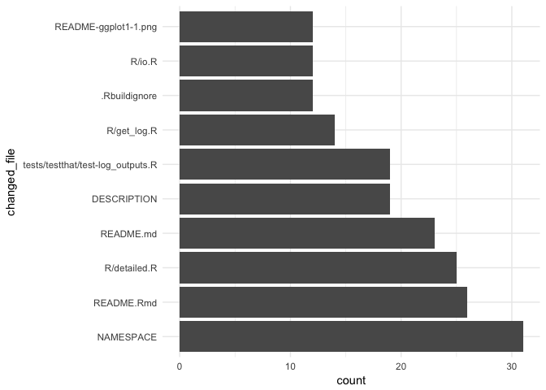
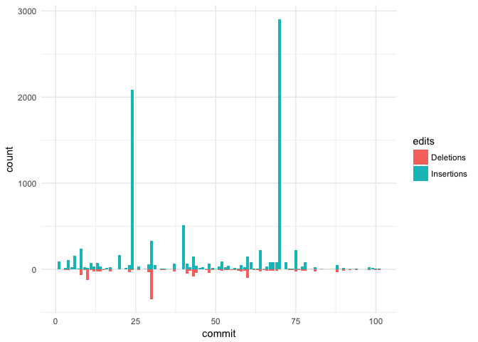
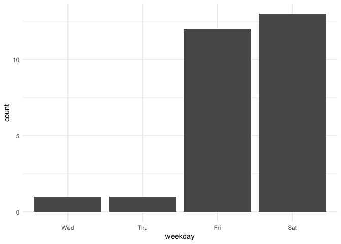

<!-- README.md is generated from README.Rmd. Please edit that file -->
*Package is work in progress! If you encounter errors / problems, please file an issue or make a PR.*

[](http://www.repostatus.org/#wip) [](https://travis-ci.org/lorenzwalthert/gitsum) [](https://codecov.io/gh/lorenzwalthert/gitsum) [](https://ci.appveyor.com/project/lorenzwalthert/gitsum)

Introduction
============

This package parses a git repository history to collect comprehensive information about the activity in the repo. The parsed data is made available to the user in a tabular format. The package can also generate reports based on the parse data.

There are two main functions for parsing the history, both return tabular data:

-   `git_log_simple` is a relatively fast parser and returns a tibble with one commit per row. There is no file-specific information.
-   `git_log_detailed` outputs a nested tibble and for each commit, the names of the amended files, number of lines changed ect. available. This function is slower.
-   `git_report` creates a html, pdf, or word report with the parsed log data according to a template. Templates can be created by the user or a template from the `gitsum` package can be used.

``` r
library("gitsum")
library("tidyverse")
library("forcats")
```

``` r
tbl <- git_log_detailed() %>%
  arrange(date) %>%
  select(short_hash, short_message, total_files_changed, nested)
tbl 
#> # A tibble: 57 x 4
#>    short_hash        short_message total_files_changed            nested
#>         <chr>                <chr>               <dbl>            <list>
#>  1       243f       initial commit                   7  <tibble [7 x 5]>
#>  2       f8ee add log example data                   1  <tibble [1 x 5]>
#>  3       6328          add parents                   3  <tibble [3 x 5]>
#>  4       dfab         intermediate                   1  <tibble [1 x 5]>
#>  5       7825          add licence                   1  <tibble [1 x 5]>
#>  6       2ac3           add readme                   2  <tibble [2 x 5]>
#>  7       7a2a    document log data                   1  <tibble [1 x 5]>
#>  8       943c        add helpfiles                  10 <tibble [10 x 5]>
#>  9       917e update infrastructur                   3  <tibble [3 x 5]>
#> 10       4fc0       remove garbage                   6  <tibble [6 x 5]>
#> # ... with 47 more rows
```

``` r
tbl$nested[[3]]
#> # A tibble: 3 x 5
#>   changed_file edits insertions deletions is_exact
#>          <chr> <dbl>      <dbl>     <dbl>    <lgl>
#> 1  DESCRIPTION     6          5         1     TRUE
#> 2    NAMESPACE     3          2         1     TRUE
#> 3  R/get_log.R    19         11         8     TRUE
```

Since the data has such a high resolution, various graphs, tables etc can be produced from it to provide insights into the git history.

Examples
========

Since the output of `git_log_detailed()` is a nested tibble, you can work on it as you work on any other tibble. Let us first have a look at who comitted to this repository:

``` r
log <- git_log_detailed()
log %>%
group_by(author_name) %>%
  count()
#> # A tibble: 3 x 2
#> # Groups:   author_name [3]
#>       author_name     n
#>             <chr> <int>
#> 1      Jon Calder     2
#> 2      jonmcalder     6
#> 3 Lorenz Walthert    49
```

We can also investigate how the number of lines of each file in the R directory evolved.

``` r
lines <- log %>%
  add_line_history()

r_files <- grep("^R/", lines$changed_file, value = TRUE)

to_plot <- lines %>%
  filter(changed_file %in% r_files)
ggplot(to_plot, aes(x = date, y = current_lines)) + 
  geom_step() + 
  scale_y_continuous(name = "Number of Lines", limits = c(0, NA)) + 
  facet_wrap(~changed_file, scales = "free_y")
```


Next, we want to see which files were contained in most commits:

``` r
log %>%
  unnest(nested) %>% # unnest the tibble
  mutate(changed_file = fct_lump(fct_infreq(changed_file), n = 10)) %>%
  filter(changed_file != "Other") %>%
  ggplot(aes(x = changed_file)) + geom_bar() + coord_flip() + 
  theme_minimal()
```



We can also easily get a visual overview of the number of insertions & deletions in commits over time:

``` r
commit.dat <- data.frame(
    edits = rep(c("Insertions", "Deletions"), each = nrow(log)),
    commit = rep(1:nrow(log), 2),
    count = c(log$total_insertions, -log$total_deletions))
    
ggplot(commit.dat, aes(x = commit, y = count, fill = edits)) + 
  geom_bar(stat = "identity", position = "identity") +  
  theme_minimal()
```



Or the number of commits broken down by day of the week:

``` r
log %>%
  mutate(weekday = factor(weekday, c("Mon", "Tue", "Wed", "Thu", "Fri", "Sat", "Sun"))) %>% 
  ggplot(aes(x = weekday)) + geom_bar() + 
  theme_minimal()
```


