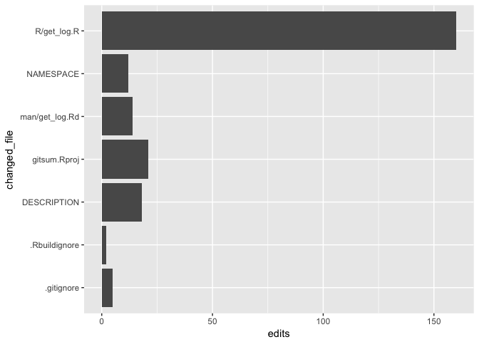

<!-- README.md is generated from README.Rmd. Please edit that file -->
*All just work in progress!*

Introduction
============

This package parses a git repository history to collect comprehensive information about the activity in the repo. The parsed data is made available to the user in a tabular format and can be used to create various statistics on the repository. Graphs, figures or even reports can be generated automatically.

To parse the git repo history, there are two functions available get\_log\_simple()`and`get\_log\_regex()\`

``` r
get_log_simple()
#> # A tibble: 4 × 13
#>            author        message_short                date  commit weekday
#>             <chr>                <chr>              <dttm>   <chr>   <chr>
#> 1 Lorenz Walthert       initial commit 2017-05-19 11:23:23 243fcdb     Fri
#> 2 Lorenz Walthert add log example data 2017-05-19 14:26:32 f8ee8fb     Fri
#> 3 Lorenz Walthert          add parents 2017-05-19 14:26:53 63281c3     Fri
#> 4 Lorenz Walthert         intermediate 2017-05-19 17:00:40 dfab201     Fri
#> # ... with 8 more variables: month <chr>, monthday <chr>, time <chr>,
#> #   year <chr>, message <chr>, left_parent <chr>, right_parent <chr>,
#> #   n_parents <int>
```

``` r
get_log_regex()
#> # A tibble: 4 × 21
#>   short_hash     author_name                date        short_message
#>        <chr>           <chr>              <dttm>                <chr>
#> 1       243f Lorenz Walthert 2017-05-19 11:23:23       initial commit
#> 2       <NA> Lorenz Walthert 2017-05-19 14:26:32 add log example data
#> 3       <NA> Lorenz Walthert 2017-05-19 14:26:53          add parents
#> 4       <NA> Lorenz Walthert 2017-05-19 17:00:40         intermediate
#> # ... with 17 more variables: short_description <chr>, hash <chr>,
#> #   left_parent <chr>, right_parent <lgl>, author_email <chr>,
#> #   weekday <chr>, month <chr>, monthday <int>, time <time>,
#> #   timezone <int>, year <int>, total_files_changed <int>,
#> #   total_insertions <int>, total_deletions <int>, message <chr>,
#> #   description <lgl>, nested <list>
```

The regex-based function can extract more information. For each commit, it also returns information on which files were changed.

``` r
tbl <- get_log_regex() %>%
  select(short_hash, message, total_files_changed, nested)
tbl 
#> # A tibble: 4 × 4
#>   short_hash              message total_files_changed           nested
#>        <chr>                <chr>               <int>           <list>
#> 1       243f       initial commit                  NA <tibble [7 × 6]>
#> 2       <NA> add log example data                   1 <tibble [1 × 6]>
#> 3       <NA>          add parents                   3 <tibble [3 × 6]>
#> 4       <NA>         intermediate                   1 <tibble [1 × 6]>
```

``` r
tbl$nested[[3]]
#> # A tibble: 3 × 6
#>   changed_file edits deletions insertions deletions_symbol
#>          <chr> <int>     <int>      <int>            <chr>
#> 1  DESCRIPTION     6         1          5                -
#> 2    NAMESPACE     3         1          2                -
#> 3  R/get_log.R    19         8         11         --------
#> # ... with 1 more variables: insertions_symbol <chr>
```

Since the data has such a high resolution, various graphs, tables ect. can be produced from it to give insights into a git history.

Examples
========

You can use standard R commands to get your summaries from the commit tibble.

``` r
log <- get_log_regex()
log %>%
group_by(author_name) %>%
  count()
#> # A tibble: 1 × 2
#>       author_name     n
#>             <chr> <int>
#> 1 Lorenz Walthert     4

log %>%
  unnest(nested) %>%
  filter(!is.na(changed_file)) %>%
  ggplot(aes(x = changed_file, y = edits)) + geom_col() + coord_flip()
```


