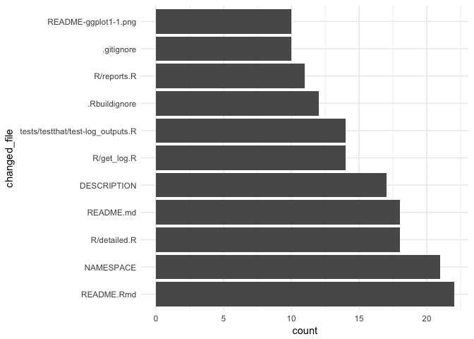

<!-- README.md is generated from README.Rmd. Please edit that file -->

*Package is work in progress\! If you encounter errors / problems,
please file an issue or make a PR.*


[](https://codecov.io/gh/lorenzwalthert/gitsum)
[](https://travis-ci.org/lorenzwalthert/gitsum)
[](https://ci.appveyor.com/project/lorenzwalthert/gitsum)

# Introduction

This package parses a git repository history to collect comprehensive
information about the activity in the repo. The parsed data is made
available to the user in a tabular format. The package can also generate
reports based on the parse data. You can install the development version
from GitHub.

``` r
remotes::install_github("lorenzwalthert/gitsum")
```

There are two main functions for parsing the history, both return
tabular data:

  - `parse_log_simple()` is a relatively fast parser and returns a
    tibble with one commit per row. There is no file-specific
    information.
  - `parse_log_detailed()` outputs a nested tibble and for each commit,
    the names of the amended files, number of lines changed ect.
    available. This function is slower.

`report_git()` creates a html, pdf, or word report with the parsed log
data according to a template. Templates can be created by the user or a
template from the `gitsum` package can be used.

Let’s see the package in action.

``` r
library("gitsum")
library("tidyverse")
library("forcats")
```

We can obtain a parsed log like this:

``` r
init_gitsum()
tbl <- parse_log_detailed() %>%
  select(short_hash, short_message, total_files_changed, nested)
tbl 
#> # A tibble: 149 x 4
#>    short_hash short_message        total_files_changed nested           
#>    <chr>      <chr>                              <int> <list>           
#>  1 243f       initial commit                         7 <tibble [7 × 5]> 
#>  2 f8ee       add log example data                   1 <tibble [1 × 5]> 
#>  3 6328       add parents                            3 <tibble [3 × 5]> 
#>  4 dfab       intermediate                           1 <tibble [1 × 5]> 
#>  5 7825       add licence                            1 <tibble [1 × 5]> 
#>  6 2ac3       add readme                             2 <tibble [2 × 5]> 
#>  7 7a2a       document log data                      1 <tibble [1 × 5]> 
#>  8 943c       add helpfiles                         10 <tibble [10 × 5]>
#>  9 917e       update infrastructur                   3 <tibble [3 × 5]> 
#> 10 4fc0       remove garbage                         6 <tibble [6 × 5]> 
#> # ... with 139 more rows
```

Since we used `parse_log_detailed()`, there is detailed file-specific
information available for every commit:

``` r
tbl$nested[[3]]
#> # A tibble: 3 x 5
#>   changed_file edits insertions deletions is_exact
#>   <chr>        <int>      <int>     <int> <lgl>   
#> 1 DESCRIPTION      6          5         1 T       
#> 2 NAMESPACE        3          2         1 T       
#> 3 R/get_log.R     19         11         8 T
```

Since the data has such a high resolution, various graphs, tables etc.
can be produced from it to provide insights into the git history.

# Examples

Since the output of `git_log_detailed()` is a nested tibble, you can
work on it as you work on any other tibble. Let us first have a look at
who comitted to this repository:

``` r
log <- parse_log_detailed()
log %>%
group_by(author_name) %>%
  summarize(n = n())
#> # A tibble: 3 x 2
#>   author_name         n
#>   <chr>           <int>
#> 1 Jon Calder          2
#> 2 jonmcalder          6
#> 3 Lorenz Walthert   141
```

We can also investigate how the number of lines of each file in the R
directory evolved. For that, we probaly want to view files with changed
names as one file. Also, we probably don’t want to see boring plots for
files that got changed only a few times. Let’s focus on files that were
changed in at least five commits.

``` r
lines <- log %>%
  unnest_log() %>%
  set_changed_file_to_latest_name() %>%
  add_line_history()
#> The following name changes were identified (11 in total):
#> ● man/{get_log.Rd => get_log_simple.Rd}
#> ● man/{parse_log.Rd => parse_log_one.Rd}
#> ● man/{get_pattern.Rd => get_pattern_multiple.Rd}
#> ● man/{get_log_regex.Rd => git_log_detailed.Rd}
#> ● man/{rmd_simple.Rd => git_report.Rd}
#> ● R/{gitsum.R => gitsum-package.R}
#> ● man/{git_log_detailed.Rd => parse_log_detailed.Rd}
#> ● man/{git_log_simple.Rd => parse_log_simple.Rd}
#> ● man/{ensure_gitusm_repo.Rd => ensure_gitsum_repo.Rd}
#> ● man/{log.Rd => gitsumlog.Rd}
#> ● man/{git_report.Rd => report_git.Rd}

r_files <- grep("^R/", lines$changed_file, value = TRUE)

to_plot <- lines %>%
  filter(changed_file %in% r_files) %>%
  add_n_times_changed_file() %>%
  filter(n_times_changed_file >= 10)
ggplot(to_plot, aes(x = date, y = current_lines)) + 
  geom_step() + 
  scale_y_continuous(name = "Number of Lines", limits = c(0, NA)) + 
  facet_wrap(~changed_file, scales = "free_y")
```

<!-- -->

Next, we want to see which files were contained in most commits:

``` r
log %>%
  unnest_log() %>%
  mutate(changed_file = fct_lump(fct_infreq(changed_file), n = 10)) %>%
  filter(changed_file != "Other") %>%
  ggplot(aes(x = changed_file)) + geom_bar() + coord_flip() + 
  theme_minimal()
```

<!-- -->

We can also easily get a visual overview of the number of insertions &
deletions in commits over time:

``` r
commit.dat <- data.frame(
    edits = rep(c("Insertions", "Deletions"), each = nrow(log)),
    commit = rep(1:nrow(log), 2),
    count = c(log$total_insertions, -log$total_deletions))
    
ggplot(commit.dat, aes(x = commit, y = count, fill = edits)) + 
  geom_bar(stat = "identity", position = "identity") +  
  theme_minimal()
```

<!-- -->

Or the number of commits broken down by day of the week:

``` r
log %>%
  mutate(weekday = factor(weekday, c("Mon", "Tue", "Wed", "Thu", "Fri", "Sat", "Sun"))) %>% 
  ggplot(aes(x = weekday)) + geom_bar() + 
  theme_minimal()
```

<!-- -->
